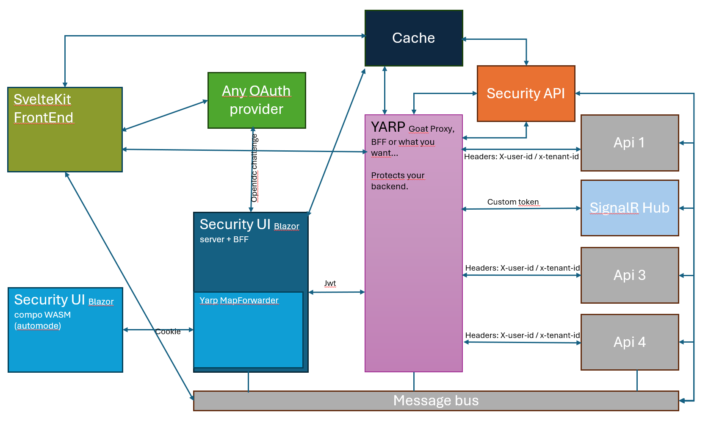

# Yarp-security-api-and-ui (alpha)

- A security API to protect your backend.
- Yarp proxy as an entry point.
- Compatible with any OAuth/OpenID Connect provider (e.g., Keycloak).
- Optional security UI for quick bootstrapping (Blazor, and components in auto mode).
- **Designed to manage subscriptions and multi-tenants.**
- SignalR example in Sveltkit project (realtime app)

## Goal

This project allows you to choose any OAuth provider and remain independent in terms of your security design. You can add any frontend (Blazor, Next.js, SvelteKit) or backend APIs in front or behind this security layer. For a full SPA, you can modify Yarp to be a full BFF (Backend for Frontend).

## Usage

Consider this project as a draft template rather than a complete setup. Customize it based on your needs.

*Yarp, with the support of the Security API, will protect your backend with its powerful authorization handler mechanism and will forward your calls to your backends with the needed information (userid, tenantid) encoded in the headers.*

> **Warning:** Never use any of the secrets exposed here and never use the Keycloak realm file to protect a real project exposed on the web. Always recreate your own secrets and configurations.

> **Warning:** It's an alpha project, don't go on prod before strong validation on your side...

## Running the Project

1. Run the Aspire AppHost.
2. Access the Blazor Security UI.

User accounts for login in Security UI:

| User | Password | Actions |
|------|-------------|------|
| adminuser | admin | can manage system roles and authorizations |
| user1| user | manage subscription and tenant |

3. Play and deep dive in the code...

*If you want to run the integration test project, pls comment this line: 
`await Task.Delay(120000);` in AspireFixiture.cs it's only there for github actions (waiting for Keycloak to be up).*

4. The endpoints

Open the security api /scalar to see all available endpoints.

## Customization

You can modify the setup based on your requirements. The project is configured with Keycloak and RabbitMQ (for revoke cache requests) but is compatible with other systems like Azure Service Bus (tested) and 0Auth (tested). You can also remove some parts if needed (caching, service bus)

## News

SvelteKit Frontend added. (not working in Aspire with fnm), so:

`npm install, npm run dev in svelte-link-ui folder`

After all the Aspire things are mounted.

- Simple onboarding endpoints + Svelle exmple. Now you can register new users and test. (Very simple and naive, but you have an example you can build on.)
- **SignalR full implementation with secured Hub and custom token.**

## Dependencies

Show your support for the following dependencies on their GitHub pages:
- [Blazor FluentUI](https://github.com/microsoft/fluentui-blazor)
- [MassTransit](https://github.com/MassTransit/MassTransit)
- [LanguageExt](https://github.com/louthy/language-ext)
- ...

## Subscriptions and multi-tenants

For your backend APIs, in the EF Core pooled DbContext factory, the user is injected (see Security API), so you can easily use EF Core query filters for a simple setup or implement your own methods to inject a DbConnection string by tenant...

## How You Can Help

If you find this project useful, you can help by reviewing the implementation or contributing to make it more generic ~~(user onboarding from oauth provider via webhook or other stuff)~~ => simple onboarding implemented. It's a side project on a boring and not "sexy" topic for me, but I hope it can be helpful to some of you. This project aims to avoid fully managed pricey solutions because, in the end, we only need simple OAuth authentication and to manage our authorization layer by ourselves. Help on that will be appreciated.

